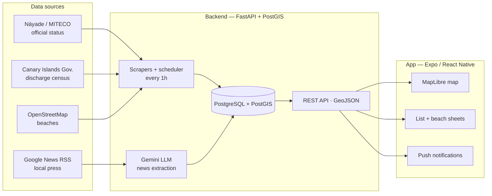

# CheckCoast Tenerife

**English** | [Español](README.es.md)

A civic app for beachgoers in Tenerife (Canary Islands, Spain):
**can I swim at this beach today?**

The official portal (Náyade, Spanish Ministry of Health) tells you
*which* beach is closed — but not *why*. CheckCoast combines the
official status with local news analysed by an LLM to answer the
question Náyade doesn't, while always keeping both sources separate and
labelled.

**Production API**: https://checkcoast.duckdns.org — interactive docs
at `/docs` and a public web page per beach at `/b/{id}` (the links the
app shares).

<!-- TODO: app screenshots/GIF once the EAS build is installed
     Suggested: island map, beach sheet with "In the press", alert banner, list -->

## Features

- 🗺️ **Island map** — 192 bathing spots (62 officially monitored +
  ~130 from OpenStreetMap) and ~180 wastewater discharge points
  (submarine outfalls), with pulsing alerts on closed beaches
- 🚩 **Real-time official status** — scraper for the Náyade portal with
  retries, synced every hour: open / warning / closed
- 📰 **"In the press"** — Google News RSS → LLM (Gemini) pipeline that
  extracts beach + event + cause (sewage spill, fuel, algae, works…)
  and shows it labelled *"according to the press"* — never mixed with
  the official status
- 🔔 **Push notifications** — alerts when a beach closes or reopens
  (Expo Push Service)
- 🧪 **Water quality** — measurement history (E. coli / enterococci,
  thresholds from Spanish Royal Decree 1341/2007) with trends and a
  ranking by municipality
- 🔍 **Full list** — search, filters by municipality and status,
  sorting by status/closures/water quality and an **"Always clean
  water"** mode (no bad samples and no official or press-reported
  pollution); groups sampling points by beach

> The app UI is in Spanish — it targets beachgoers in Tenerife.

## Architecture



- **Backend**: FastAPI · SQLAlchemy 2 + GeoAlchemy2 · Alembic ·
  APScheduler · Python 3.12
- **Data**: PostgreSQL 16 + PostGIS 3.4
- **Frontend**: Expo SDK 57 · React Native 0.86 · TypeScript ·
  MapLibre (OSM basemap + Esri satellite) · Expo Notifications
- **Infra**: Docker Compose (DB + API) · GitHub Actions CI · EAS Build

## Getting started

### Option A — everything in Docker

```bash
docker compose up -d        # PostGIS + API (Alembic migrates on startup)
```

API at `http://localhost:8001` — interactive docs at `/docs`.

> **Environment variables**: create a `.env` in the repo root with
> `GEMINI_API_KEY=...` ([aistudio.google.com](https://aistudio.google.com),
> free tier) to enable LLM extraction of news. Without it everything
> else works the same — news items just stay unprocessed.
> `ADMIN_API_KEY` protects the manual status change (without it that
> endpoint is disabled).
> `DATABASE_URL` has a local default, and so do the other variables
> (`NAYADE_SYNC_SECONDS`, `GEMINI_MODEL`…) — see
> `backend/app/config.py`.

### Option B — local API (development with `--reload`)

```bash
docker compose up -d db           # PostGIS only
cd backend
python -m venv .venv
.venv\Scripts\activate            # Windows PowerShell (Linux/macOS: source .venv/bin/activate)
pip install -r requirements.txt
copy .env.example .env            # Linux/macOS: cp .env.example .env
alembic upgrade head
python -m scripts.ingest_outfalls     # ~180 discharge points
python -m scripts.ingest_beaches      # 61 official sampling points
python -m scripts.ingest_osm_beaches  # ~106 OSM beaches
python -m scripts.ingest_beach_status # Náyade status (first load)
uvicorn app.main:app --reload --port 8001
```

### Frontend

```bash
cd frontend
npm install
npx expo start --dev-client --port 8082
```

> **Note:** the app uses MapLibre (a native module), so it needs a
> *development build* installed on the device
> (`eas build --profile development`) — it doesn't work in Expo Go.
> `EXPO_PUBLIC_API_URL` points to your computer's local IP.

## API

| Endpoint | Description |
|---|---|
| `GET /beaches` | GeoJSON of beaches with official status + `reported_at` |
| `GET /beaches/{id}/quality` | Water quality measurements |
| `GET /beaches/{id}/incidents` | Official incidents (closures/reopenings) |
| `GET /beaches/{id}/news` | Related news (LLM extraction) |
| `GET /beaches/{id}/nearby-outfalls` | Outfalls near the beach |
| `GET /beaches/stats` | Aggregates by municipality (ranking) |
| `GET /outfalls` | GeoJSON of discharge points (`?status=legal\|illegal\|unknown`) |
| `GET /alerts` | Active alerts — `via` field: `official` / `press` |
| `POST /beaches/{id}/status` | Manual status change (scraper fallback) — requires `X-Admin-Key` header |
| `POST /devices` | Expo push token registration |

## Testing and CI

```bash
cd backend && .venv\Scripts\python -m pytest tests/ -q   # 134 tests
cd frontend && npx tsc --noEmit && npm test              # typecheck + 86 tests
cd backend && ruff check . && ruff format --check .      # Python lint + format
cd frontend && npm run format:check                      # Prettier format
```

GitHub Actions spins up a PostGIS service, runs
`alembic upgrade head`, checks Ruff and Prettier and runs both suites
against synthetic fixtures (no dependency on real data).

## Official data sources

| Data | Source |
|---|---|
| Outfalls and land-to-sea discharges | 2025 Discharge Census — Government of the Canary Islands ([SITCAN Open Data](https://opendata.sitcan.es/dataset/actualizacion-del-censo-de-vertidos-desde-tierra-al-mar-ano-2025)) |
| Bathing areas and water quality | 2025 National Census of Bathing Waters — MITECO / Náyade system |
| Real-time closure status | Náyade portal — Spanish Ministry of Health (scraping) |
| Unmonitored beaches | OpenStreetMap (`natural=beach`, via Overpass) |
| Context for closures | Google News RSS — Tenerife local media |

## Domain notes

- **"Open" ≠ "safe"**: it means *no active official incident* — the
  app never promises safety, it only reflects official data
- OSM beaches (grey) are **unmonitored**: the official status doesn't
  cover them
- Press content is always labelled and kept separate from the official
  status — see [DECISIONS.md](DECISIONS.md) (in Spanish)

## Project structure

```
├── backend/            # FastAPI + ingestion + press pipeline
│   ├── app/            # routers, models, scraper, LLM, notify
│   ├── alembic/        # migrations
│   ├── scripts/        # official source ingestion
│   └── tests/          # pytest (synthetic fixtures)
├── frontend/           # Expo + React Native + MapLibre
│   ├── components/     # map, list, beach sheet, municipal ranking
│   └── lib/            # api, notifications, formatting
├── docker-compose.yml  # PostGIS + API
└── .github/workflows/  # CI: backend + frontend
```

## License

[MIT](LICENSE)
