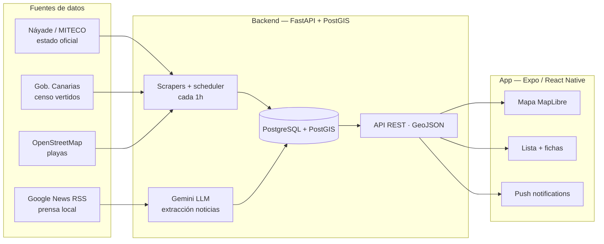

# CheckCoast Tenerife

App cívica para bañistas de Tenerife: **¿puedo bañarme hoy en esta playa?**

El portal oficial (Náyade, Ministerio de Sanidad) dice *qué* playa está
cerrada — pero no *por qué*. CheckCoast combina el estado oficial con
prensa local analizada por LLM para responder la pregunta que Náyade no
contesta, manteniendo ambas fuentes siempre separadas y etiquetadas.

**API en producción**: https://checkcoast.duckdns.org — docs
interactivas en `/docs` y página web pública por playa en
`/b/{id}` (los enlaces que comparte la app).

<!-- TODO: screenshots/GIF de la app cuando esté el build EAS instalado
     Sugeridas: mapa isla, ficha con "En la prensa", banner de alerta, lista -->

## Qué hace

- 🗺️ **Mapa de la isla** — 192 puntos de baño (62 monitorizados
  oficialmente + ~130 de OpenStreetMap) y ~180 puntos de vertido
  (emisarios submarinos), con alertas pulsantes sobre las playas
  cerradas
- 🚩 **Estado oficial en tiempo real** — scraper del portal Náyade con
  reintentos, sincronizado cada hora: abierta / aviso / cerrada
- 📰 **"En la prensa"** — pipeline Google News RSS → LLM (Gemini) que
  extrae playa + evento + causa (vertido, fuel, algas, obras…) y lo
  muestra etiquetado *"según prensa"* — nunca mezclado con el estado
  oficial
- 🔔 **Notificaciones push** — aviso cuando una playa se cierra o reabre
  (Expo Push Service)
- 🧪 **Calidad del agua** — histórico de mediciones (E. coli /
  enterococo, umbrales RD 1341/2007) con evolución y ranking por
  municipio
- 🔍 **Lista completa** — buscador, filtros por municipio y por estado,
  ordenación por estado/cierres/calidad del agua y modo **"Agua siempre
  apta"** (sin muestras malas ni contaminación oficial o de prensa);
  agrupa puntos de muestreo por playa

## Arquitectura



- **Backend**: FastAPI · SQLAlchemy 2 + GeoAlchemy2 · Alembic ·
  APScheduler · Python 3.12
- **Datos**: PostgreSQL 16 + PostGIS 3.4
- **Frontend**: Expo SDK 57 · React Native 0.86 · TypeScript ·
  MapLibre (basemap OSM + satélite Esri) · Expo Notifications
- **Infra**: Docker Compose (DB + API) · GitHub Actions CI · EAS Build

## Puesta en marcha

### Opción A — todo en Docker

```bash
docker compose up -d        # PostGIS + API (alembic migra solo al arrancar)
```

API en `http://localhost:8001` — docs interactivas en `/docs`.

> **Variables de entorno**: crea un `.env` en la raíz con
> `GEMINI_API_KEY=...` ([aistudio.google.com](https://aistudio.google.com),
> free tier) para activar la extracción LLM de prensa. Sin ella el resto
> funciona igual — solo las noticias quedan sin procesar.
> `ADMIN_API_KEY` protege el cambio manual de estado (sin ella ese
> endpoint queda deshabilitado).
> `DATABASE_URL` tiene default local; el resto de vars
> (`NAYADE_SYNC_SECONDS`, `GEMINI_MODEL`…) también
> — ver `backend/app/config.py`.

### Opción B — API en local (desarrollo con `--reload`)

```bash
docker compose up -d db           # solo PostGIS
cd backend
python -m venv .venv
.venv\Scripts\activate            # Windows PowerShell
pip install -r requirements.txt
copy .env.example .env
alembic upgrade head
python -m scripts.ingest_outfalls     # ~180 puntos de vertido
python -m scripts.ingest_beaches      # 61 puntos de muestreo oficiales
python -m scripts.ingest_osm_beaches  # ~106 playas OSM
python -m scripts.ingest_beach_status # estado Náyade (primera carga)
uvicorn app.main:app --reload --port 8001
```

### Frontend

```bash
cd frontend
npm install
npx expo start --dev-client --port 8082
```

> **Nota:** la app usa MapLibre (módulo nativo) → necesita una
> *development build* instalada en el dispositivo
> (`eas build --profile development`), no funciona con Expo Go.
> `EXPO_PUBLIC_API_URL` apunta a la IP local del PC.

## API

| Endpoint | Descripción |
|---|---|
| `GET /beaches` | GeoJSON de playas con estado oficial + `reported_at` |
| `GET /beaches/{id}/quality` | Mediciones de calidad del agua |
| `GET /beaches/{id}/incidents` | Incidentes oficiales (cierres/aperturas) |
| `GET /beaches/{id}/news` | Noticias relacionadas (extracción LLM) |
| `GET /beaches/{id}/nearby-outfalls` | Emisarios cercanos a la playa |
| `GET /beaches/stats` | Agregados por municipio (ranking) |
| `GET /outfalls` | GeoJSON de vertidos (`?status=legal\|illegal\|unknown`) |
| `GET /alerts` | Alertas activas — campo `via`: `official` / `press` |
| `POST /beaches/{id}/status` | Cambio manual de estado (respaldo del scraper) — requiere cabecera `X-Admin-Key` |
| `POST /devices` | Registro de Expo push tokens |

## Testing y CI

```bash
cd backend && .venv\Scripts\python -m pytest tests/ -q   # 106 tests
cd frontend && npx tsc --noEmit && npm test              # typecheck + 42 tests
```

GitHub Actions levanta un PostGIS de servicio, ejecuta
`alembic upgrade head` y corre ambas suites con fixtures sintéticos
(sin dependencia de datos reales).

## Fuentes de datos oficiales

| Dato | Fuente |
|---|---|
| Emisarios y vertidos tierra-mar | Censo de Vertidos 2025 — Gobierno de Canarias ([SITCAN Open Data](https://opendata.sitcan.es/dataset/actualizacion-del-censo-de-vertidos-desde-tierra-al-mar-ano-2025)) |
| Zonas de baño y calidad del agua | Censo Nacional de Zonas de Aguas de Baño 2025 — MITECO / sistema Náyade |
| Estado de cierre en tiempo real | Portal Náyade — Ministerio de Sanidad (scraping) |
| Playas no monitorizadas | OpenStreetMap (`natural=beach`, vía Overpass) |
| Contexto de cierres | Google News RSS — medios locales de Tenerife |

## Notas de dominio

- **"Abierta" ≠ "segura"**: significa *sin incidencia oficial activa* —
  la app nunca promete seguridad, solo refleja datos oficiales
- Las playas OSM (gris) son **no monitorizadas**: el estado oficial no
  las cubre
- El contenido de prensa va siempre etiquetado y separado del estado
  oficial — ver [DECISIONS.md](DECISIONS.md)

## Estructura

```
├── backend/            # FastAPI + ingesta + pipeline de prensa
│   ├── app/            # routers, modelos, scraper, LLM, notify
│   ├── alembic/        # migraciones
│   ├── scripts/        # ingesta de fuentes oficiales
│   └── tests/          # pytest (fixtures sintéticos)
├── frontend/           # Expo + React Native + MapLibre
│   ├── components/     # mapa, lista, ficha, ranking municipal
│   └── lib/            # api, notificaciones, formato
├── docker-compose.yml  # PostGIS + API
└── .github/workflows/  # CI: backend + frontend
```
